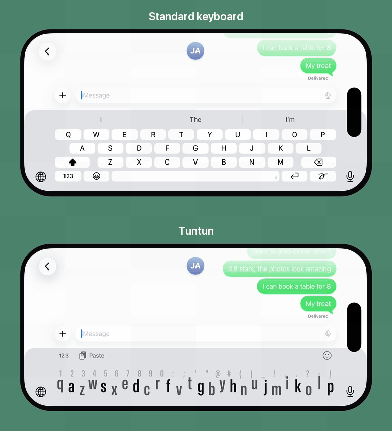

# Tuntun

Tuntun is an iOS keyboard inspired by [Minuum](https://minuum.com): a full
keyboard compressed into a single line, about a third the height of the one
you use now, so you keep seeing the app you're typing in. Flick right for
space, left to delete a word, up for capitals, down for return; hold to zoom
in on an exact letter. Named after *escribir al tuntún* - typing by feel.

To regenerate the language models from their public corpora, run
`Tools/rebuild-models.sh` (sources and licenses in [ATTRIBUTION.md](ATTRIBUTION.md)).
